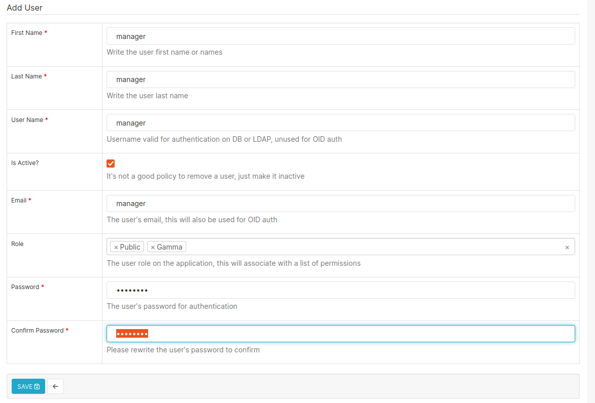
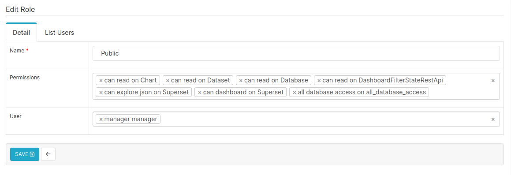
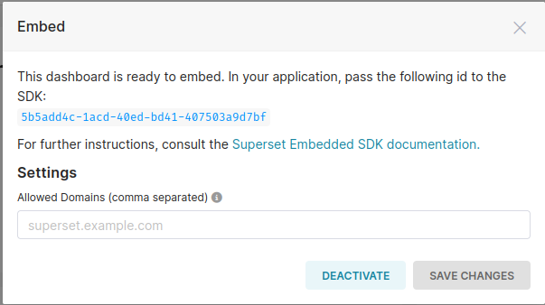

# Superset How-to Embedding 

## In superset Admin Console 

- Create `manager` role

- Update **Public user permissions** 
    - Menu -> Settings / List Role / Public
    - Add the following permissions
        * `can read on Chart`
        * `can read on Dataset`
        * `can read on Dashboard`
        * `can read on Database`
        * `can dashboard on Superset`
        * `can explore json on Superset`
        * `all database access on all_database_access`


- Select a dashboard 
- [...] Embed dashboard (**LEAVE ALLOWED DOMAINS EMPTY**)


- Copy dashboard's `uuid`
- Using the API
    - Login to get an **Authorisation token**
    - Create a **CSRF Token**
    - Request a **Guest token** using the dashboard's `uuid`
    ```json
        {
            "resources": [
                {
                    "type": "dashboard",
                    "id": "5b5add4c-1acd-40ed-bd41-407503a9d7bf"
                }
            ],
            "rls": [
            ],
            "user": {
                "first_name": "manager",
                "last_name": "manager",
                "username": "manager"
            }
        }
    ```
- In `/html/test.html` file, update
    - the dashboard's `uuid`
    - and the **Gest Token**
- Open new **PRIVATE BROWSING** Window
- Connect to [file:///home/transformatek/projects/superset-ttk/html/test.html](file:///home/transformatek/projects/superset-ttk/html/test.html) 
- Should Work 
- If you get 401 error `GET http://localhost:8088/api/v1/me/roles/ UNAUTHORIZED` -> Refresh the ***Guest token**

## Useful links
Installation 
- [https://superset.apache.org/docs/installation/installing-superset-using-docker-compose/](https://superset.apache.org/docs/installation/installing-superset-using-docker-compose/)
- [https://superset.apache.org/docs/databases/sql-server](https://superset.apache.org/docs/databases/sql-server)
- [https://github.com/pymssql/pymssql](https://github.com/pymssql/pymssql)

Guides 
- [https://medium.com/@khushbu.adav/embedding-superset-dashboards-in-your-react-application-7f282e3dbd88](https://medium.com/@khushbu.adav/embedding-superset-dashboards-in-your-react-application-7f282e3dbd88)
- [https://medium.com/@huamichaelchen/end-to-end-example-of-setting-up-superset-embedded-dashboard-f72fc985559](https://medium.com/@huamichaelchen/end-to-end-example-of-setting-up-superset-embedded-dashboard-f72fc985559)
- [https://www.tetranyde.com/blog/embedding-superset](https://www.tetranyde.com/blog/embedding-superset)

Hints
- [https://stackoverflow.com/questions/75207112/superset-ui-embedded-sdk-embedding-dashboard-returns-403-forbidden ](https://stackoverflow.com/questions/75207112/superset-ui-embedded-sdk-embedding-dashboard-returns-403-forbidden)
- [https://github.com/ra002890/superset-embedded-example/tree/init](https://github.com/ra002890/superset-embedded-example/tree/init)